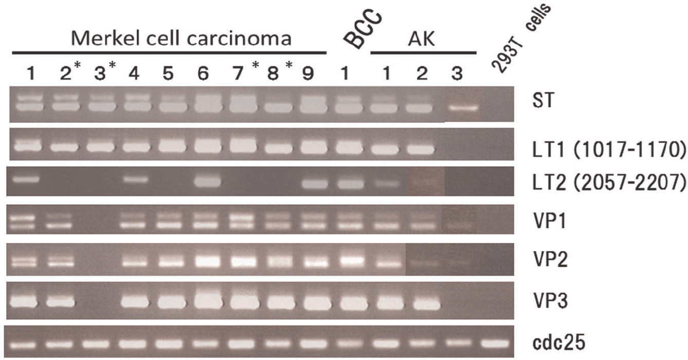
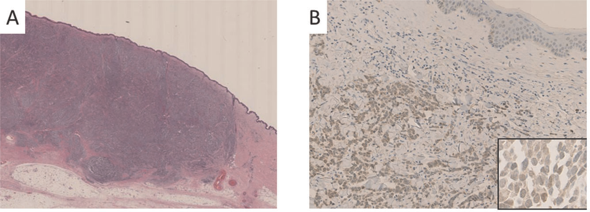
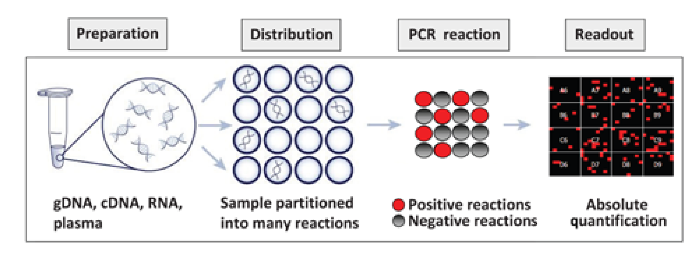
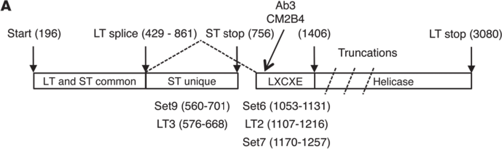
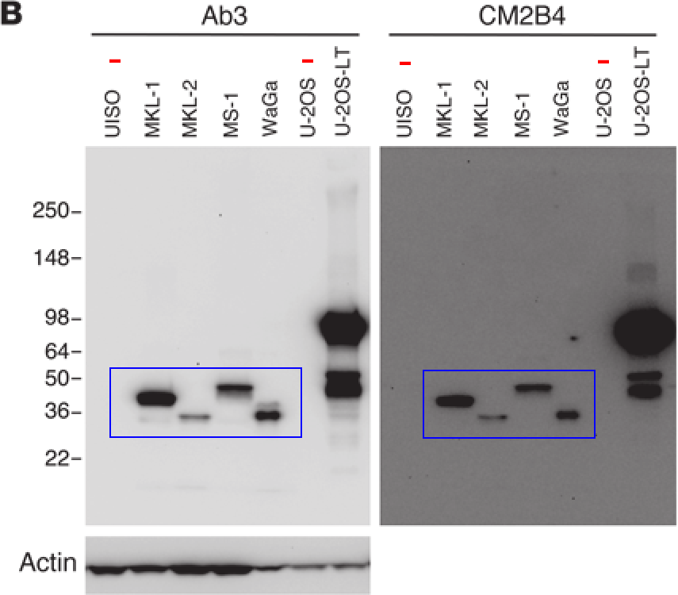
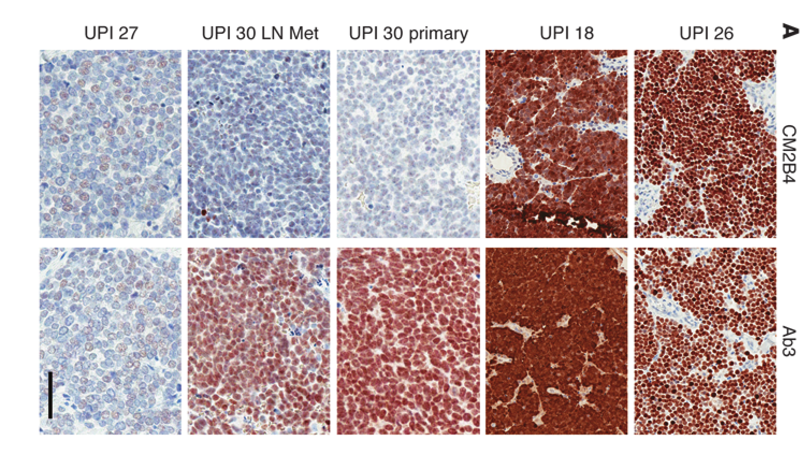
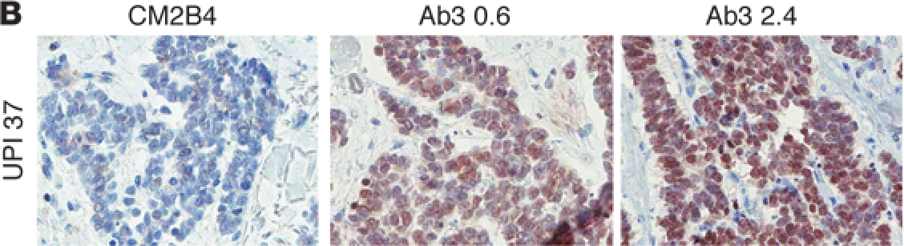
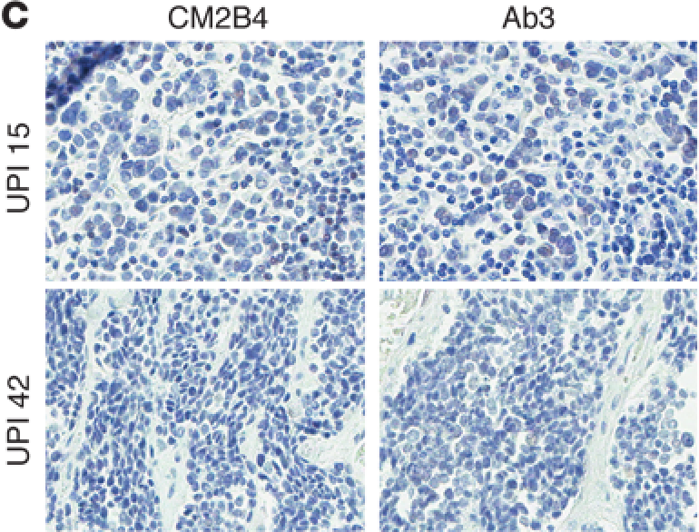
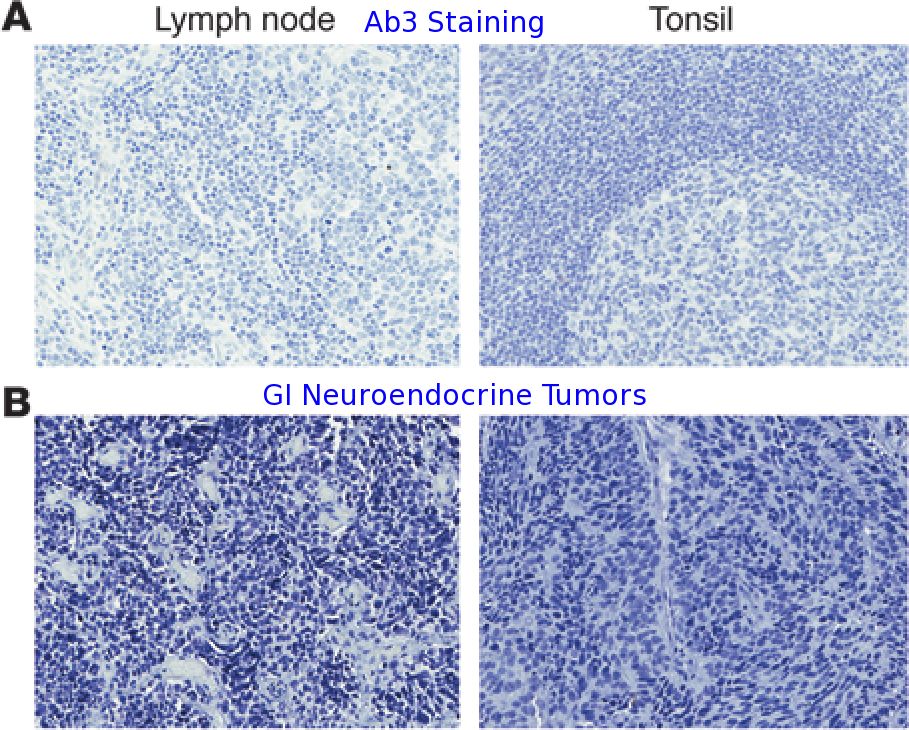

```{r setup,include=FALSE}
require(plyr)
require(reshape)
require(ggplot2)
setwd("/mnt/NIH_GROUP/Dermatology/Brownell Lab/Kenny/Presentations/BrownellLabMeeting_20121217/")
source('setup.R')
setwd("/mnt/NIH_GROUP/Dermatology/Brownell Lab/Kenny/Presentations/BrownellLabMeeting_20121217/reports/20121217_Brownell_LabMtg")

## Plot theme
my.theme <- theme(axis.text.x=element_text(size=20), 
                  axis.text.y=element_text(size=20),
                  axis.title.x=element_text(size=25),
                  axis.title.y=element_text(size=25, angle=90))

my.theme.smallx <- theme(axis.text.x=element_text(size=12, angle=270, vjust=0.5), 
                         axis.text.y=element_text(size=15, angle=90),
                         axis.title.x=element_text(size=20),
                         axis.title.y=element_text(size=20, angle=90))

my.theme.boxplot <- theme(axis.text.x=element_text(size=15), 
                          axis.text.y=element_text(size=15),
                          axis.title.x=element_text(size=20),
                          axis.title.y=element_text(size=20),
                          strip.text=element_text(size=15))


```

## MCPyV genome


Science 2008;319;5866:1096-1100. doi:10.1126/science.1152586, Fig. 3
---

## MCPyV Infection

1. MCC cells do not typically harbor episomal MCPyV viral DNA
2. MCPyV is clonally integrated in the tumor chromosomal DNA
3. Mutations resulting in truncation of large T antigen (LT)
4. Expression of full length LT promotes viral replication
5. sT is necessary but not sufficent for tumorigenesis

---

## Detection of MCPyV

* Several studies show ~80% of MCCs have virus present, mostly by PCR on FFPE tissues
* CN variation is prevalent
* IHC LT reported as ~80% positive (CM2B4 antibody)
* IHC LT reported as ~90% positive (CM5E1 antibody)

--- 

## 


--- 

## Frequency of MCPyV Infection in Skin Tumors


<!---
* Conventional PCR detected MCPyV in 8/9 MCC, 1/46 BCC, 3/52 AK, and no others
* Variability in the fragments detected
--->

--- 

## IHC using CM2B4 (MCC)
All cases found positive by conventional qPCR were also positive by IHC


--- 

## IHC using CM2B4 (BCC)
All cases found positive by conventional qPCR were also positive by IHC


--- 

## [Digital PCR](https://www.invitrogen.com/site/us/en/home/Products-and-Services/Applications/PCR/real-time-pcr/real-time-pcr-applications/digital-pcr/viral-load-quantification.html?icid=fr-dpcr-1 "Link") ([Video](http://media.invitrogen.com.edgesuite.net/ab/applications-technologies/real-time-pcr/digitalpcr/index.html "Video"))

Instead of comparing Ct values, just count!




<!---
After PCR amplification, nucleic acids may be quantified by counting the regions that contain PCR end-product, positive reactions.
In conventional PCR, the number of PCR amplification cycles is proportional to the starting copy number (exponential amplification)
Issues with conventional PCR include sub-optimal efficiency, plateau, low concentrations not amplifiable/detectable
Allows larger range of difference detection (not limited to 2-fold change)
--->

--- 

## Digital PCR for Viral Copy Number
Used primers to the small T antigen and RNaseP as a contol


The negative IHC results for 1 MCC and 3 AK cases were clearly linked to their low viral loads.

<!---
confirmed with a second primer set?
--->

--- 

## Methylation Status of Skin Tumors
* Hypermethylation of host DNA has been detected in SV40 polyomavirus-related tumors and cell lines as well as in some MCC
* Observed DNA hypermethylation of RASSF1A in 6/9 MCC, 7/46 BCC, 1/52 AK

--- 

## Summary
* 100% MCPyV infection frequency (small sample size?)
* Loss of LT2 fragment in MCC mets
* Differing range of viral load for MCC, AK
* Strong correlation between IHC and viral load
* digital PCR is advantageous

---

##


---

## Hypothesis
1. It is widely thought that MCPyV is a causative oncogenic mechanism, but 20% of MCC tumors don't have virus.

2. Few mutations have been found in oncogenes or tumor suppressors.

*Is it the case that the tests for MCPyV are not sensitive enough, and all tumors have the virus?*

--- 

## Detecting MCPyV


--- 

## Detecting MCPyV


J Clin Invest. 2011;121(9):3623–3634. doi:10.1172/JCI46323, Supp. Fig. 1

--- 

## Western Blotting of MCC Cell Lines



<!---
* Used CM2B4 mouse mAB (detects 2nd exon of LT)
* Generated new antibody (Ab3) to 260 N-terminal residues of LT
* Tested on MCC cell lines (Mkl-1, Mkl-2, MS-1, WaGa, UISO, U-2OS, U2OS+LT)
* Western blot with Ab3 or CM2B4 of cell lysates prepared from MCC cell lines showing a predominant signal for truncated large T antigen between 36 and 50 kDa. U-2OS-LT contains a full-length large T antigen cDNA. Actin blot indicates protein loading.
--->

--- 

## IHC on MCC Sections
60 patients, 75 FFPE MCC tumor specimens (not all were stained)

```{r ihcvirusbinary, echo=FALSE, cache=FALSE, fig.height=4}
tbl <- with(patient.virus.status, table(CM2B4=CM2B4 == 0, Ab3=Ab3 == 0))
tbl.withmargin <- addmargins(tbl)
tbl.withmargin <- as.data.frame(tbl.withmargin)

p <- ggplot(tbl.withmargin, aes(x=factor(CM2B4, ordered=T, levels=c(TRUE, FALSE, "Sum"), labels=c("Negative", "Positive", "Total")),
                     y=factor(Ab3, ordered=T,levels=c("Sum", TRUE, FALSE), labels=c("Total", "Negative", "Positive")), fill=Freq))
p <- p + geom_tile() + geom_text(aes(label=Freq), size=8, color="white")
p <- p + theme_bw() + my.theme + labs(x="CM2B4", y="Ab3")
p <- p + geom_hline(aes(yintercept=1.5), size=2) + geom_vline(aes(xintercept=2.5), size=2)
print(p)
```

--- 

## IHC Staining Intensity Distribution
3: strong; 2: moderate; 1: weak; 0: absent


--- 

## IHC Staining Intensities, Original Data
```{r ihcvirusorig,echo=FALSE, cache=FALSE, fig.height=5, fig.width=6}
tbl <- with(patient.virus.status, table(CM2B4=CM2B4, Ab3=Ab3))
tbl.withmargin <- addmargins(tbl)
tbl.withmargin <- as.data.frame(tbl.withmargin)

p <- ggplot(tbl.withmargin, aes(x=factor(CM2B4, ordered=T, levels=c(0,1,2,3, "Sum")),
                     y=factor(Ab3, ordered=T,levels=c("Sum", 0, 1, 2, 3)), fill=Freq))
p <- p + geom_tile() + geom_text(aes(label=Freq), size=8, color="white")
p <- p + theme_bw() + my.theme + labs(x="CM2B4", y="Ab3")
p <- p + geom_hline(aes(yintercept=1.5), size=2) + geom_vline(aes(xintercept=4.5), size=2)
print(p)
```

<!---
* 38 cases where CM2B4 >= 2 were also Ab3 >= 2.
* 50 cases have Ab3 >= 2.
* 9 cases where Ab3  > 0 and CM2B4 = 0.
* Overall higher intensity for Ab3 (only because of samples >= 3)
* Consistent staining within patients
--->

--- 

## Virus Positive IHC Stains (Figure 3A)


--- 

## CM2B4^- Ab3^+ IHC Stains (Figure 3B)


--- 

## CM2B4^- Ab3^- IHC Stains (Figure 3C)


--- 

## Ab3 Control IHC Stains (Figure 4A,B)


---

## Ab3 Control IHC Stains (Figure 4C,D,E)


---

## IHC Conclusions
* Ab3 more sensitive than and as specific as CM2B4
* There are more MCPyV positive MCC tumors than originally thought
* Stained one MCC MCPyV positive case with controls

---

## qPCR Detection of MCPyV DNA

Primer | T Antigen Loci
------ | -------------
[LT2](/mnt/NIH_GROUP/Dermatology/Brownell Lab/Kenny/Presentations/BrownellLabMeeting_20121217/doc/references/becker_08_mc_859644.pdf "LT2") |Large
LT3 | Small
Set6 | Large
Set7 | Large
Set9 | Small

__TPO__ was used as copy number control.

<!---
* Two previously developed primer sets (LT2, LT3)
* Three new primer sets (Set6, Set7, Set9)
--->

--- 

## MCPyV Copy Number in MCC Cell Lines


<!---
For validation, ran them on the cell lines (4 MCPyV positive, 2 MCPyV negative, and a positive control).
U-20S w/ LT cDNA amplified using LT primers (LT2, Set6, Set7) but not sT primers (LT3, Set9)
Ct values for Mkl-2 were approx equal to TPO and normalized wrt to this to compare to all other samples.
--->

--- 

## qPCR Copy Number Distribution


--- 

## qPCR Copy Number Distribution, per sample
Is qPCR viral CN as low as 0.03 (from UPI 60) detection of MCPyV DNA?
```{r qpcrdistpersample,echo=FALSE,warning=FALSE, cache=FALSE, fig.height=5, fig.width=11}
cn.data <- melt(data.by.patient.max, id.vars=c("UPI", "CM2B4", "Ab3"), measure.vars=c("LT2", "LT3", "Set6", "Set7", "Set9"))
p <- ggplot(cn.data, aes(x=factor(UPI), y=log2(value), fill=factor(Ab3)))
p <- p + geom_boxplot() + geom_jitter(position=position_jitter(width=0.1)) + scale_y_continuous(expression(log[2] * "(CN value)")) + labs(x="Patient UPI") + scale_fill_brewer("Ab3",type="seq")
p <- p + geom_hline(yintercept=log2(2), color="red", linetype=2)
p <- p + geom_hline(yintercept=log2(0.03), color="green", linetype=2)
p <- p + theme_bw() + my.theme.smallx
p

```


<!---
Performed qPCR on the FFPE DNA using LT2, LT3, Set7, TPO in triplicate. If any were less than 1, then Set6 and Set9 were tested.
48 of 60 cases (80%), at least one primer set detected greater than 2 copies per cell, consistent with the clonal integration of MCPyV DNA in every tumor cell
5 cases (UPI 27, 47, 49, 57, and 60) yielded viral copy number values greater than 0.03 but less than 0.1, but still stained with antibodies (very little DNA, but protein!)
2 cases (UPI 15, 42) had CN > 0.1 but were negative with both antibodies (DNA but no protein)
No signal found in control tissues (FFPE tonsillar, reactive lymph nodes, Mkl-2 as positive control)
TPO amplified fine in all samples with signal similar to Mkl-2.
--->

--- 

## Correlation of qPCR Copy Number and IHC intensity


<!---
* "Significant" correlation between all combos of antibody and qPCR
--->

--- 

## Re-compute Correlation of qPCR Copy Number and IHC intensity
```{r, echo=FALSE, warning=FALSE, cache=TRUE, comment=""}
as.data.frame(corstarsl(cbind(rodig.Table.S1[, c("Ab3_max", "CM2B4")], rodig.Table.S1[, c("LT2", "LT3", "Set6", "Set7", "Set9")]),
          type="spearman"))
```

--- 

## qPCR and IHC Intensity Data (Maximum Ab3)
```{r qpcrihcab3,echo=FALSE,warning=FALSE,cache=TRUE, fig.height=5.5, fig.width=11}
ab3.data <- melt(data.by.patient.max, id.vars=c("UPI", "Ab3"), measure.vars=c("LT2", "LT3", "Set6", "Set7", "Set9"))
p <- ggplot(ab3.data, aes(x=factor(Ab3), y=value))
p <- p + geom_boxplot() + geom_jitter(position=position_jitter(width=0.1)) + scale_y_log10("") + labs(x="Max Ab3")
p <- p + facet_wrap(~ variable, scales="free_x")
p <- p + theme_bw() + my.theme.boxplot
p
```

--- 

## qPCR and IHC Intensity Data (CM2B4, 2 ug/ml)
```{r qpcrihccm2b4,echo=FALSE,warning=FALSE,cache=TRUE, fig.height=5.5, fig.width=11}
cm2b4.data <- melt(rodig.Table.S1, id.vars=c("UPI", "CM2B4"), measure.vars=c("LT2", "LT3", "Set6", "Set7", "Set9"))
p <- ggplot(cm2b4.data, aes(x=factor(CM2B4), y=value))
p <- p + geom_boxplot() + geom_jitter(position=position_jitter(width=0.1)) + scale_y_log10("") + labs(x="CM2B4")
p <- p + facet_wrap(~ variable, scales="free_x")
p <- p  + theme_bw() + my.theme.boxplot
p
```

--- 

## Discussion Points
1. Immunohistochemistry
  * Ab3 is more sensitive than and as specific as CM2B4, comparable to CM5E1 sT antibody ([detection of 92% (47/51) of MCC](/mnt/NIH_GROUP/Dermatology/Brownell Lab/Kenny/Presentations/BrownellLabMeeting_20121217/doc/references/JCI46323.v3.pdf "CM5E1"))
  * Advantage of IHC over qPCR for FFPE samples

---

## Discussion Points
2. qPCR
  * Higher chance of detection due to more primer sets
  * Large variation in some samples, doesn't correspond to IHC
  * CN > 0.1 in 55/60 (90%) of MCCs (consistent with clonal integration?)
  * Even at CN of 0.03, still higher than control tissues (and detected by IHC)

---

## Discussion Points
3. Mutations
  * Lack of point mutations in 112 genes
  * Three p53 mutations, two in the MCPyV negative samples!
4. Even virus positive tumors (integrated virus) may not express T antigen?
