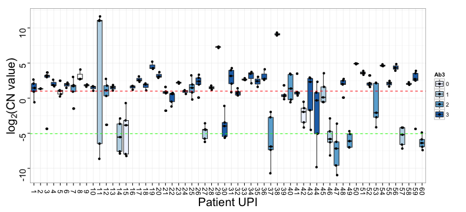
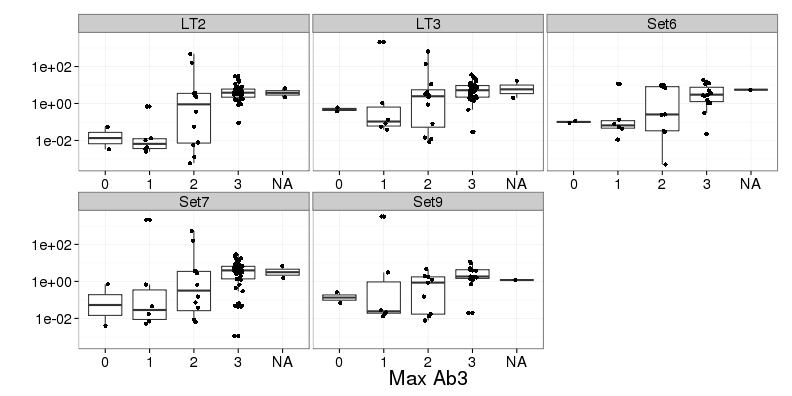

## MCV genome


--- .class #id 

## Slide 1

1. MCC cells do not typically harbor episomal MCV viral DNA
2. MCV is clonally integrated in the tumor chromosomal DNA
3. Mutations resulting in truncation of large T antigen (LT)
4. Expression of full length LT promotes viral replication

--- .class #id 

## Slide 2

* Several studies show ~80% of MCCs have virus present
* Mostly by PCR on FFPE tissues
* CN variation
* IHC to sT and LT reported as well (again, ~80% positive for LT)

--- .class #id 

## Analysis of MCV Load


--- .class #id 

## Hypothesis
1. It is widely thought that MCV is a causative oncogenic mechanism, but 20% of MCC tumors don't have virus.

2. Few mutations have been found in oncogenes or tumor suppressors.

*Is it the case that the tests for MCV are not sensitive enough, and all tumors have the virus?*

--- .class #id 

## Detecting MCV


--- .class #id 

## Western Blotting of MCC Cell Lines


<!---
* Used CM2B4 mouse mAB (detects 2nd exon of LT)
* Generated new antibody (Ab3) to 260 N-terminal residues of LT
* Tested on MCC cell lines (Mkl-1, Mkl-2, MS-1, WaGa, UISO, U-2OS, U2OS+LT)
* Western blot with Ab3 or CM2B4 of cell lysates prepared from MCC cell lines showing a predominant signal for truncated large T antigen between 36 and 50 kDa. U-2OS-LT contains a full-length large T antigen cDNA. Actin blot indicates protein loading.
--->

--- .class #id 

## IHC of MCC Sections
* 60 patients, 75 FFPE MCC tumor specimens

 


--- .class #id 

## IHC Staining Intensity Distribution
3: strong; 2: moderate; 1: weak; 0: absent


--- .class #id 

## Virus status by IHC, Original Data
 


<!---
* 38 cases where CM2B4 >= 2 were also Ab3 >= 2.
* 50 cases have Ab3 >= 2.
* 9 cases where Ab3  > 0 and CM2B4 = 0.
* Overall higher intensity for Ab3 (only because of samples >= 3)
* Consistent staining within patients
--->

--- .class #id 

## Virus Positive IHC Stains (Figure 3A)


--- .class #id 

## CM2B4^- Ab3^+ IHC Stains (Figure 3B)


--- .class #id 

## CM2B4^- Ab3^- IHC Stains (Figure 3C)


--- .class #id 

## IHC Conclusions
* Ab3 more sensitive than CM2B4

--- .class #id 

## qPCR Detection of MCPyV DNA

Primer|T Antigen Loci
------|-------------
[LT2](/mnt/NIH_GROUP/Dermatology/Brownell Lab/Kenny/Presentations/BrownellLabMeeting_20121217/doc/references/becker_08_mc_859644.pdf "LT2") |Large
LT3|Small
Set6|Large
Set7|Large
Set9|Small

__TPO__ was used as copy number control.

<!---
* Two previously developed primer sets (LT2, LT3)
* Three new primer sets (Set6, Set7, Set9)
--->

--- .class #id 

## MCV Copy Number in MCC Cell Lines


<!---
For validation, ran them on the cell lines (4 MCPyV positive, 2 MCPyV negative, and a positive control).
U-20S w/ LT cDNA amplified using LT primers (LT2, Set6, Set7) but not sT primers (LT3, Set9)
Ct values for Mkl-2 were approx equal to TPO and normalized wrt to this to compare to all other samples.
--->

--- .class #id 

## qPCR Copy Number Distribution


--- .class #id 

## qPCR Copy Number Distribution, per sample
 

qPCR viral CN as low as 0.03 (from UPI 60) is specific for detection of MCPyV DNA?

<!---
Performed qPCR on the FFPE DNA using LT2, LT3, Set7, TPO in triplicate. If any were less than 1, then Set6 and Set9 were tested.
48 of 60 cases (80%), at least one primer set detected greater than 2 copies per cell, consistent with the clonal integration of MCPyV DNA in every tumor cell
5 cases (UPI 27, 47, 49, 57, and 60) yielded viral copy number values greater than 0.03 but less than 0.1, but still stained with antibodies (very little DNA, but protein!)
2 cases (UPI 15, 42) had CN > 0.1 but were negative with both antibodies (DNA but no protein)
No signal found in control tissues (FFPE tonsillar, reactive lymph nodes, Mkl-2 as positive control)
TPO amplified fine in all samples with signal similar to Mkl-2.
--->

--- .class #id 

## Correlation of qPCR Copy Number and IHC intensity


<!---
* "Significant" correlation between all combos of antibody and qPCR
--->

--- .class #id 

## Re-compute Correlation of qPCR Copy Number and IHC intensity

```
##          Ab3_max    CM2B4      LT2      LT3     Set6     Set7 Set9
## Ab3_max              0.79     0.62     0.45     0.51     0.44 0.43
## CM2B4   4.44e-16              0.69     0.57     0.63     0.54 0.49
## LT2     5.87e-09 3.97e-11              0.81     0.75     0.72 0.67
## LT3     8.76e-05  3.3e-07        0              0.54     0.81 0.82
## Set6     0.00143 7.39e-05 6.76e-08 0.000507              0.46 0.61
## Set7    0.000108 1.29e-06 2.22e-13        0    0.004          0.54
## Set9     0.00907  0.00339 5.13e-06 4.46e-10 5.08e-05 0.000407
```


--- .class #id 

## Correlation of log(qPCR Copy Number) and IHC intensity

```
##          Ab3_max    CM2B4      LT2     LT3     Set6     Set7 Set9
## Ab3_max              0.76     0.65    0.35     0.48     0.37 0.33
## CM2B4   1.91e-14              0.76     0.5     0.63     0.51 0.42
## LT2     8.14e-10  3.2e-14             0.73     0.84     0.68 0.59
## LT3      0.00293 9.35e-06 1.16e-13             0.44     0.84 0.89
## Set6     0.00327 6.06e-05 2.72e-11 0.00558              0.33 0.52
## Set7     0.00144 5.39e-06 2.05e-11       0   0.0428           0.7
## Set9      0.0521   0.0135 8.94e-05 1.2e-13 0.000819 1.03e-06
```


--- .class #id 

## qPCR and IHC Intensity Data (Maximum Ab3)
 


--- .class #id 

## qPCR and IHC Intensity Data (CM2B4, 2 ug/ml)
 


--- .class #id 

## Discussion Points
* Ab3 is more sensitive than and as specific as CM2B4
* comparable to CM5E1 sT antibody ([detection of 92% (47/51) of MCC](/mnt/NIH_GROUP/Dermatology/Brownell Lab/Kenny/Presentations/BrownellLabMeeting_20121217/doc/references/JCI46323.v3.pdf "CM5E1"))
* CN > 0.1 in 55/60 (90%) of MCCs (consistent with clonal integration?)
* More primer sets, higher chance of detection
* Even at CN of 0.03, still higher than control tissues (and detected by IHC)
* Advantage of IHC over qPCR for FFPE samples
* Lack of point mutations in 112 genes
* Three p53 mutations, two in the MCV negative samples!
* Even virus positive tumors may not express T antigen?

--- .class #id 

## Analysis of MCV Load


--- .class #id 

## Analysis of MCV Load
Investigate the frequency of MCPyV infection in skin tumors (MCC, BCC, AK, BD, etc.)


<!---
* Conventional PCR detected MCPyV in 8/9 MCC, 1/46 BCC, 3/52 AK, and no others
* Variability in the fragments detected
--->

--- .class #id 

## IHC using CM2B4 (MCC)
All cases found positive by conventional qPCR were also positive by IHC


--- .class #id 

## IHC using CM2B4 (BCC)
All cases found positive by conventional qPCR were also positive by IHC


--- .class #id 

## Digital PCR
Changes the problem from comparing Ct values to a counting problem (Poisson statistics)


<!---
After PCR amplification, nucleic acids may be quantified by counting the regions that contain PCR end-product, positive reactions.
In conventional PCR, the number of PCR amplification cycles is proportional to the starting copy number (exponential amplification)
Issues with conventional PCR include sub-optimal efficiency, plateau, low concentrations not amplifiable/detectable
Allows larger range of difference detection (not limited to 2-fold change)
--->

--- .class #id 

## Digital PCR for Viral Copy Number
Used primers to the small T antigen (confirmed with a second primer set?) and RNaseP as a contol


The negative IHC results for 1 MCC and 3 AK cases were clearly linked to their low viral loads.

--- .class #id 

## Methylation Status of Skin Tumors
* Hypermethylation of host DNA has been detected in SV40 polyomavirus-related tumors and cell lines as well as in some MCC
* Observed DNA hypermethylation of RASSF1A in 6/9 MCC, 7/46 BCC, 1/52 AK

--- .class #id 

## Summary
* 100% MCPyV infection frequency (small sample size?)
* Loss of LT2 fragment in MCC mets
* Differing range of viral load for MCC, AK
* Strong correlation between IHC and viral load
